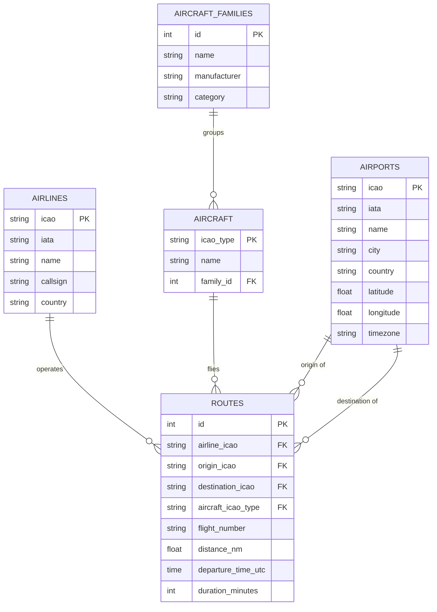

# ERD — Airlines & Routes

`routes` is the central fact table. Both `origin_icao` and `destination_icao` are foreign keys to `airports.icao` — the two relationship lines above represent the same table referenced twice (a route's origin and destination). See `.docs/DATA_DICTIONARY.md` for full column-level detail.
